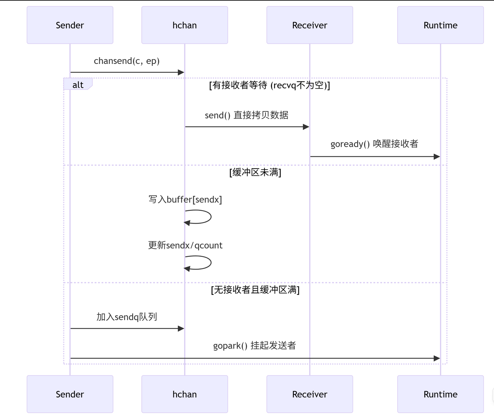
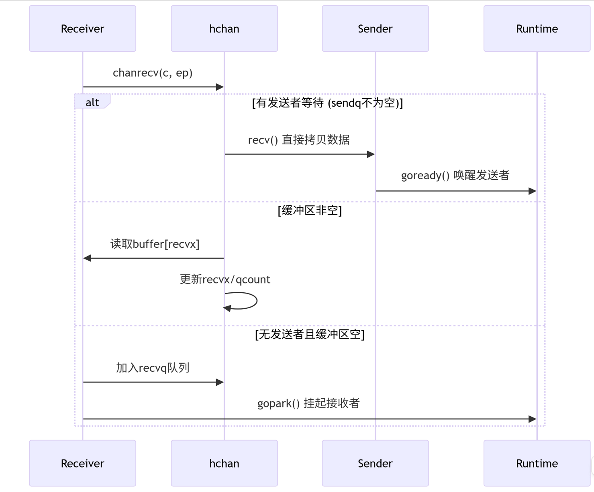

# Channel学习

## 1.基本概念
* channel用于不同的goroutine之间安全传递数据，类似"数据管道"的功能
* 线程安全的，在channel的数据结构中已经有了锁，不需要额外加锁
* channel是FIFO的结构

## 2.Channel的基本操作
### 2.1 声明和创建
    // 声明一个传递 int 类型的 channel（未初始化，值为 nil）
    var ch chan int

    // 使用 make 初始化一个无缓冲 channel
    ch := make(chan int)

    // 初始化一个缓冲大小为 10 的 channel
    bufferedCh := make(chan int, 10)

## 2.2 Channel的类型
### 2.2.1 无缓冲Channel
* 发送操作会阻塞，直到有另外一个goroutine执行接收操作
* 接收操作会阻塞，直到有另一个goroutine执行发送操作
```    ch := make(chan int)
	go func() {
		ch <- 42
	}()
	value := <-ch
	fmt.Println(value) 
```

### 2.2.2 有缓冲Channel
* 有一个固定大小的缓冲区
* 只有缓冲器满时，发送操作才会阻塞
* 只有缓冲区空时，接收操作才会阻塞
```
    ch := make(chan int, 3)  // 容量为3的有缓冲channel
    ch <- 1
    ch <- 2
    ch <- 3
    // ch <- 4   // 这里会阻塞，因为缓冲器满
```

### 2.2.3 关闭Channel
close(ch)
* 关闭后，不能再发送数据，不能往Channel中写数据
* 可以继续接收已发送的数据 v, ik := <-ch ,ok为false时，表示channel已关闭且无数据

### 2.2.4 select语句
用于处理多个channel的发送与接收
``` ch := make(chan int)
	ch2 := make(chan int)
	select {
	case v:= <-ch:
		fmt.Println("received ch", v)
	case ch2 <- 100:
		fmt.Println("received ch2")
	case <- time.After(1 * time.Second):
		fmt.Println("timeout")
	default:
		fmt.Println("nothing received")
	}
```

## Channel核心源码分析
### 核心数据结构
```
type hchan struct {
    // 队列状态
    qcount   uint           // 当前队列中元素数量
    dataqsiz uint           // 环形队列大小（缓冲channel才有）
    buf      unsafe.Pointer // 指向环形队列的指针
    elemsize uint16         // 元素大小
    
    // 状态标志
    closed   uint32         // channel关闭标志
    
    // 类型信息
    elemtype *_type         // 元素类型信息
    
    // 索引位置
    sendx    uint           // 发送位置索引
    recvx    uint           // 接收位置索引
    
    // 等待队列
    recvq    waitq          // 阻塞的接收者队列
    sendq    waitq          // 阻塞的发送者队列
    
    // 锁
    lock     mutex          // 互斥锁，保护所有字段
} ```
dataqsize:环形队列的容量，有缓冲Channel传入的数值
qcount:当前环形队列中的元素个数
buf:指向环形缓冲器的指针
elemsize:单个元素的大小
closed:标识channel是否已关闭的标志位
elemtype:元素类型
sendx:环形队列中下一个发送位置的索引
recvx:环形队列中下一个接收位置索引
recvq:阻塞读取goroutine的队列(缓冲区空而阻塞)
sendq:阻塞写入groutine的队列(缓冲区满而阻塞)

等待队列字段
type waitq struct {
    first *sudog
    last  *sudog
}

type sudog struct {
    g        *g            // 关联的goroutine
    elem     unsafe.Pointer // 数据元素指针
    isSelect bool          // 是否在select语句中
    next     *sudog        // 链表指针
    prev     *sudog
    ...
}

特征:
1.双向链表实现FIFO
2.每个被阻塞的goroutine对应一个sudog


发送的源码如下:
```
func chansend(c *hchan, ep unsafe.Pointer, block bool, callerpc uintptr) bool {
    // 1. 检查 channel 是否为 nil
    if c == nil {
        if !block {
            return false
        }
        gopark(nil, nil, waitReasonChanSendNilChan, traceEvGoStop, 2)
        throw("unreachable")
    }
    
    // 2. 快速路径检查：非阻塞且 channel 未关闭且 (缓冲区已满或没有接收者)
    if !block && c.closed == 0 && ((c.dataqsiz == 0 && c.recvq.first == nil) ||
        (c.dataqsiz > 0 && c.qcount == c.dataqsiz)) {
        return false
    }
    
    // 3. 加锁
    lock(&c.lock)
    
    // 4. 检查 channel 是否已关闭
    if c.closed != 0 {
        unlock(&c.lock)
        panic(plainError("send on closed channel"))
    }
    
    // 5. 尝试直接发送给等待的接收者
    if sg := c.recvq.dequeue(); sg != nil {
        send(c, sg, ep, func() { unlock(&c.lock) }, 3)
        return true
    }
    
    // 6. 如果缓冲区有空间，写入缓冲区
    if c.qcount < c.dataqsiz {
        qp := chanbuf(c, c.sendx)
        typedmemmove(c.elemtype, qp, ep)
        c.sendx++
        if c.sendx == c.dataqsiz {
            c.sendx = 0
        }
        c.qcount++
        unlock(&c.lock)
        return true
    }
    
    // 7. 阻塞发送处理
    if !block {
        unlock(&c.lock)
        return false
    }
    
    gp := getg()
    mysg := acquireSudog()
    mysg.elem = ep
    mysg.waitlink = nil
    gp.waiting = mysg
    mysg.g = gp
    mysg.isSelect = false
    mysg.c = c
    gp.param = nil
    c.sendq.enqueue(mysg)
    
    gopark(chanparkcommit, unsafe.Pointer(&c.lock), waitReasonChanSend, traceEvGoBlockSend, 2)
    
    // 被唤醒后清理
    gp.waiting = nil
    if gp.param == nil {
        if c.closed == 0 {
            throw("chansend: spurious wakeup")
        }
        panic(plainError("send on closed channel"))
    }
    gp.param = nil
    releaseSudog(mysg)
    return true
}
```

下面对几个核心的流程进行分析:

1.快速路径分析
    if !block && c.closed == 0 && ((c.dataqsiz == 0 && c.recvq.first == nil) ||
        (c.dataqsiz > 0 && c.qcount == c.dataqsiz)) {
        return false
    }
    条件1:若block是否为非阻塞模式，如多路复用select或者default为false；若为普通的检查ch <-x，则跳过当前判断，继续往下走
    条件2:c.closed == 0，表示channel未被关闭
    条件3:c.dataqsize == 0代表无缓冲channel，且阻塞队列中没有接受者
    条件4：与条件3相呼应，c.dataqsize == c.qcount代表缓冲区已满，无法立即发送，返回false

2.直接发送给等待的接受者
    if sg := c.recvq.dequeue(); sg != nil {
        send(c, sg, ep, func() { unlock(&c.lock) }, 3)
        return true
    }
从接收的阻塞队列中获取sudog,并数据拷贝给等待的groutine
send函数里面还有一些逻辑，包括直接拷贝数据给接收方，设置接收方的goroutine参数，唤醒接收方goroutine

3. 如果缓冲区有空间，写入缓冲区
    if c.qcount < c.dataqsiz {
        qp := chanbuf(c, c.sendx)
        typedmemmove(c.elemtype, qp, ep)
        c.sendx++
        if c.sendx == c.dataqsiz {
            c.sendx = 0
        }
        c.qcount++
        unlock(&c.lock)
        return true
    }
qp := chanbuf(c, c.sendx)
获取sendx的物理地址

typedmemmove(c.elemtype, qp, ep) 将数据拷贝到缓冲区中

c.sendx++ 发送的地址加1
c.qcount++ 缓冲区元素加1

gp := getg()       // 获取当前执行的goroutine的指针
mysg := acquireSudog()  // 创建sudog
mysg.elem = ep          // 将待发送的数据的指针赋值给mysg
mysg.waitlink = nil
gp.waiting = mysg       // 表示当前goroutine要被阻塞的sudog
mysg.g = gp
mysg.isSelect = false   // 表示不是被slect多路复用的channel
mysg.c = c
gp.param = nil
c.sendq.enqueue(mysg)    // 发送到阻塞队列
gopark(chanparkcommit, unsafe.Pointer(&c.lock), waitReasonChanSend, traceEvGoBlockSend, 2) // 挂起操作

4.唤醒后的一些清理操作
gp.waiting = nil
    if gp.param == nil {
        if c.closed == 0 {
            throw("chansend: spurious wakeup")
        }
        panic(plainError("send on closed channel"))
    }
    gp.param = nil
    releaseSudog(mysg)
    return true

被阻塞的goroutine会进行清理操作，包括对sudog的释放，gp.waiting的置空

发送的时序图如下所示:


接收的时序图如下所示:
